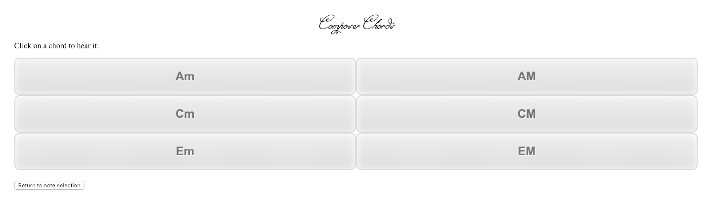

# Composer Chords

## Summary

A web application that first has users select a note through its GUI then generates several different chords, displayed as tiles, that contain the note. These tiles play sound files of the chord that they are labeled as upon being clicked. This application would be extremely useful for the process of arranging music where one often must take melodic lines and construct chords around them.

## Further development plans

Add diminished and augmented chords. Add circle of fifths with all chords playable. Remove need for chord files and rely entirely on MIDI.js, programatically assigning chord values.

## Screenshot from current version

